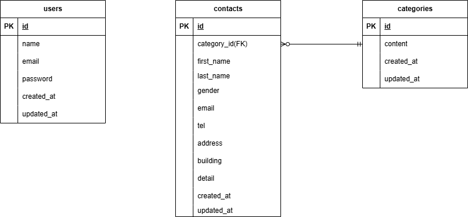

# お問い合わせフォーム

## 環境構築

**Docker ビルド**

1. `git clone git@github.com:kamihshi0422/-name--kadai1.git`
2. DockerDesktop アプリを立ち上げる
3. `docker-compose up -d --build`

**Laravel 環境構築**

1. `docker-compose exec php bash`
2. `composer install`
3. 「.env.example」ファイルを コピーして「.env」を作成し、DB の設定を以下のように変更

```text
DB_CONNECTION=mysql
DB_HOST=mysql
DB_PORT=3306
DB_DATABASE=laravel_db
DB_USERNAME=laravel_user
DB_PASSWORD=laravel_pass
```

5. アプリケーションキーの作成

```bash
php artisan key:generate
```

6. マイグレーションの実行

```bash
php artisan migrate
```

7. シーディングの実行

```bash
php artisan db:seed
```

## 使用技術(実行環境)
- PHP8.1 (php-fpm)
- Laravel 8.83.8
- MySQL 8.0.26
- Docker / Docker Compose

## ER 図


## URL

- 開発環境：http://localhost/
- 管理画面：http://localhost/admin
- phpMyAdmin:：http://localhost:8080/